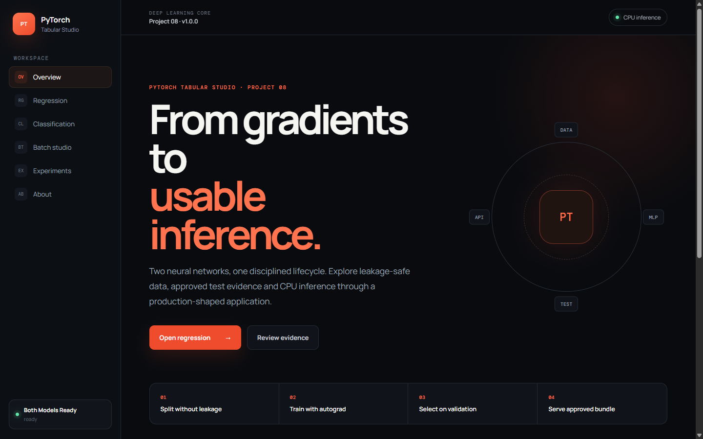

# PyTorch Tabular Studio

A complete Deep Learning workflow for tabular regression and multiclass
classification. Two approved PyTorch MLPs are served through a versioned
FastAPI backend and a responsive React interface with batch inference,
reproducible artifacts and explicit model limitations.

## Product

- **California Housing regression** estimates median district house value in
  units of USD 100,000.
- **Wine classification** predicts one of three classes and displays the full
  probability distribution without presenting probability as certainty.
- **PyTorch Tabular Studio** provides schema-driven forms, approved examples,
  metrics against baselines, training curves, model cards and CSV batch
  inference limited to 100 observations.



```text
dataset -> train/validation/test -> train-only scaler -> DataLoader -> MLP
        -> validation checkpoint -> test evaluation -> signed CPU bundle
        -> FastAPI /api/v1 -> React/Vite
```

## Verified evidence

| Task | Approved model | Primary result | Acceptance gate |
|---|---|---:|---|
| Regression | MLP `v1.0.0` | MAE `0.5097` | Beats mean-regressor MAE |
| Classification | MLP `v1.0.0` | Macro F1 `0.9599` | Beats prior classifier |

Classification also records accuracy `0.9630`, log loss `0.0840` and its
confusion matrix. Regression records RMSE `0.8002` and R² `-0.0505`.

The checked-in regression bundle uses the bundled official-source reference
sample because this build environment had no dataset network access. For a
full benchmark, place the complete official `california_housing.csv` in
`data/raw/` and retrain. The loader validates the official eight-feature
schema; runtime inference never downloads data.

## Run locally

Prerequisites: Python 3.12 and Node.js 20+.

```powershell
Set-Location "C:\JeanLoa\Path-AI-Engineer\Deep-Learning-Core\08-pytorch-regression-classification-api"

py -3.12 -m venv .venv
.\.venv\Scripts\Activate.ps1
python -m pip install --upgrade pip
python -m pip install -r requirements.txt -r requirements-dev.txt

Set-Location .\frontend
npm ci
npm run build
Set-Location ..

$env:PYTHONPATH = "$PWD\src;$PWD\backend"
python -m uvicorn app.main:app --app-dir backend --host 127.0.0.1 --port 8008
```

Open [http://127.0.0.1:8008](http://127.0.0.1:8008). Swagger is available at
[http://127.0.0.1:8008/docs](http://127.0.0.1:8008/docs).

For frontend hot reload, keep FastAPI on port `8008`, run `npm run dev` inside
`frontend/`, and open [http://127.0.0.1:5178](http://127.0.0.1:5178).

## Validate

```powershell
python -m pytest -q
python -m mypy src backend
python scripts\validate_project.py

Set-Location .\frontend
npm run build
npm test
Set-Location ..

python scripts\smoke_test.py --base-url http://127.0.0.1:8008
```

## Docker

```powershell
docker build -t pytorch-tabular-studio:v1.0.0 .
docker run --rm -p 8080:8080 --name pytorch-tabular-studio pytorch-tabular-studio:v1.0.0
python scripts\smoke_test.py --base-url http://127.0.0.1:8080
```

The multi-stage image builds React and serves the production SPA from FastAPI.
Only approved model bundles are copied into the runtime image.

## API v1

- `GET /api/v1/health`
- `GET /api/v1/health/live`
- `GET /api/v1/health/ready`
- `GET /api/v1/tasks`
- `GET /api/v1/tasks/{task}/schema`
- `GET /api/v1/tasks/{task}/model-card`
- `POST /api/v1/predictions/{task}`
- `POST /api/v1/predictions/{task}/batch`

Unknown tasks return 404, invalid features 422, oversized batches 413 and
unavailable approved models 503.

## Repository guide

- `src/pytorch_tabular/` — data, models, training, evaluation, experiments,
  artifacts and CPU inference.
- `backend/app/` — FastAPI registry, schemas and versioned routes.
- `frontend/` — React, TypeScript and Vite product interface.
- `artifacts/models/` — approved, hash-validated inference bundles.
- `configs/` — dataset, model and experiment definitions.
- `labs/` — five focused PyTorch learning labs.
- `tests/` — ML, integration, acceptance, bundle, API and contract tests.
- `docs/` — architecture, contracts, model cards and demo guidance.

## Limitations

- This is an educational benchmark product, not a valuation or quality
  decision system.
- Input range warnings are not calibrated uncertainty intervals.
- Wine probabilities are model outputs, not guarantees or causal evidence.
- California Housing represents historical district aggregates, not current
  individual property prices.
- CPU inference is the supported release target.

See [architecture](docs/architecture.md),
[artifact contract](docs/artifact-contract.md) and
[demo guide](docs/demo-guide.md). The complete day-by-day evidence is in the
[project closeout](docs/project-closeout.md), with copy-ready
[v1.0.0 release notes](docs/release-v1.0.0.md).

Project 08 closes global days 211–231 of the AI Engineer path. The intended
release is `v1.0.0` after a clean Git state and Docker smoke test.

<!-- Superseded planning README retained in-place because this sandbox cannot
delete the pre-existing tracked file contents. It is not part of the rendered
project documentation. The original source is also preserved in
docs/legacy-readme.md.

## 🧠 Descripción

Proyecto aplicado para construir modelos de **regresión** y **clasificación** usando PyTorch, y exponer al menos uno mediante una API simple.

Este proyecto continúa el aprendizaje del:

```txt
07-neural-network-foundations-lab
```

pero ahora pasa de entender la mecánica interna de una red neuronal a usar PyTorch de forma profesional.

Este proyecto pertenece al:

```txt
Plan 2 — Deep Learning Core
```

y forma parte del conjunto:

```txt
Núcleo de Redes Neuronales Profundas
```

La idea no es usar PyTorch como magia.

La idea es entender cómo PyTorch organiza el flujo de Deep Learning:

```txt
tensores
→ dataset
→ modelo
→ loss
→ optimizer
→ training loop
→ evaluation
→ inference
→ API
```

---

## 🎯 Objetivo

Crear modelos simples de regresión y clasificación usando PyTorch, entrenarlos, evaluarlos, guardarlos y exponer al menos uno mediante una API de inferencia.

El objetivo técnico es conectar fundamentos de redes neuronales con una implementación más profesional y reutilizable.

---

## 👤 Usuario objetivo

* AI Engineer en formación.
* Estudiante de Deep Learning.
* Desarrollador que quiere usar PyTorch con criterio.
* Reclutador técnico interesado en modelos PyTorch aplicados.
* Futuro constructor de CNNs, Transformers, Diffusion Models y sistemas RL.

---

## 🧱 Arquitectura esperada

```txt
Dataset
   ↓
Preprocesamiento
   ↓
Tensores
   ↓
Dataset / DataLoader
   ↓
Modelo PyTorch
   ↓
Training Loop
   ↓
Evaluation Loop
   ↓
Model Saving
   ↓
Inference Service
   ↓
FastAPI
```

---

## 🔁 Flujo técnico

```txt
data/raw
   ↓
data cleaning
   ↓
feature preparation
   ↓
X / y
   ↓
torch.Tensor
   ↓
Dataset / DataLoader
   ↓
nn.Module
   ↓
loss function
   ↓
optimizer
   ↓
training loop
   ↓
evaluation
   ↓
save model
   ↓
predict endpoint
```

---

## 🧩 Módulos

### Módulo 1 — Tensor Preparation

Convertir datos en tensores aptos para PyTorch.

Incluye:

* Separación de `X` e `y`.
* Conversión a `torch.Tensor`.
* Tipos de datos correctos.
* Shapes correctos.
* Preparación de batches.

Pregunta central:

```txt
¿Cómo convierto datos normales en datos que PyTorch puede entrenar?
```

---

### Módulo 2 — PyTorch Regression Model

Crear un modelo de regresión con PyTorch.

Incluye:

* `nn.Module`.
* Capas lineales.
* Activación si aplica.
* Predicción numérica.
* Loss de regresión.
* Métricas de regresión.

Pregunta central:

```txt
¿Cómo uso una red neuronal para predecir un valor numérico?
```

---

### Módulo 3 — PyTorch Classification Model

Crear un modelo de clasificación con PyTorch.

Incluye:

* `nn.Module`.
* Capas lineales.
* Salida para clases.
* Binary classification o multiclass classification.
* Loss de clasificación.
* Métricas de clasificación.

Pregunta central:

```txt
¿Cómo uso una red neuronal para predecir una clase?
```

---

### Módulo 4 — Training Loop

Construir el ciclo de entrenamiento.

Incluye:

* Forward pass.
* Loss.
* `loss.backward()`.
* `optimizer.step()`.
* `optimizer.zero_grad()`.
* Epochs.
* Registro de pérdida.

Pregunta central:

```txt
¿Qué ocurre dentro de cada epoch cuando entreno con PyTorch?
```

---

### Módulo 5 — Evaluation Loop

Evaluar modelos sin actualizar pesos.

Incluye:

* Modo evaluación.
* Desactivación de gradientes.
* Predicciones sobre test.
* Cálculo de métricas.
* Comparación train vs test.
* Detección básica de overfitting.

Pregunta central:

```txt
¿Cómo sé si el modelo aprendió o solo memorizó?
```

---

### Módulo 6 — Model Saving and Loading

Guardar y cargar el modelo entrenado.

Incluye:

* Guardado de pesos.
* Carga del modelo.
* Separación entre entrenamiento e inferencia.
* Validación de que el modelo cargado predice correctamente.

Pregunta central:

```txt
¿Cómo convierto el modelo entrenado en un artefacto reutilizable?
```

---

### Módulo 7 — Model Inference API

Exponer el modelo mediante una API simple.

Incluye:

* Request schema.
* Response schema.
* Service de inferencia.
* Endpoint `/predict`.
* Manejo básico de errores.
* Prueba con Swagger o cliente HTTP.

Pregunta central:

```txt
¿Cómo hago que un modelo PyTorch pueda ser usado fuera del notebook?
```

---

## 🧪 Labs

### tec-labs

* `tec-pytorch-tensors-lab`
* `tec-pytorch-dataloader-lab`
* `tec-pytorch-training-loop-lab`
* `tec-regression-vs-classification-loss-lab`
* `tec-pytorch-model-saving-lab`
* `tec-pytorch-inference-api-lab`

---

## 📊 Métricas

### Regresión

* MAE.
* MSE.
* RMSE.
* R² si aplica.
* Loss por epoch.

### Clasificación

* Accuracy.
* Precision.
* Recall.
* F1-score.
* Confusion Matrix.
* Loss por epoch.

---

## 📌 Próximos pasos

* Elegir dataset simple para regresión.
* Elegir dataset simple para clasificación.
* Preparar `X` e `y`.
* Convertir datos a tensores.
* Crear `Dataset` y `DataLoader`.
* Crear modelo de regresión con `nn.Module`.
* Crear modelo de clasificación con `nn.Module`.
* Implementar training loop.
* Implementar evaluation loop.
* Calcular métricas.
* Guardar modelo entrenado.
* Cargar modelo para inferencia.
* Crear endpoint `/predict`.
* Probar API.
* Documentar diferencias entre regresión y clasificación.
* Grabar demo o explicación corta.
* Actualizar LinkedIn y CV.

---

## ✅ Entregable final

Al terminar este proyecto debe existir:

* Modelo PyTorch de regresión.
* Modelo PyTorch de clasificación.
* Training loop funcional.
* Evaluation loop funcional.
* Métricas registradas.
* Modelo guardado.
* Modelo cargado para inferencia.
* API simple de predicción.
* Tests básicos.
* README profesional.
* Labs documentados.
* Explicación clara de cómo PyTorch organiza el entrenamiento.

---

## 🧭 Regla final

```txt
No uso PyTorch para saltarme los fundamentos.
Uso PyTorch para construir mejor después de entenderlos.
```

Este proyecto no busca entrenar una red enorme.

Busca demostrar que puedo usar PyTorch con criterio para construir modelos entrenables, evaluables, guardables y servibles por API.
-->
